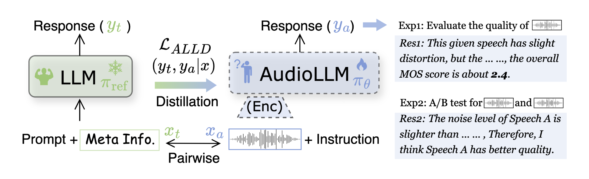

# AudioLMs-Descriptive-Speech-Quality-Evaluators
ICLR 2025

[Huggingface Data](https://huggingface.co/datasets/PeacefulData/speech-quality-descriptive-caption)

# Audio Large Language Models Can Be Descriptive Speech Quality Evaluators

This repository contains code for generating descriptive captions for speech quality evaluation based on the paper "Audio Large Language Models Can Be Descriptive Speech Quality Evaluators" (ICLR 2025).


<p align="center">
  
  <br />
  <span>
The framework of ALLD and training examples. “Meta info.” is the multi-dimensional ratings annotated by human listeners for the pairwise speech sample. ALLD aims to align the audio
LLM response ya to yt via token-level distillation, where πref is exceptionally set as an expert LLM.
  </span>
</p>

## Overview

The system analyzes audio files to extract quality metrics, then uses the LLaMA-3.1 70B model to generate descriptive captions that evaluate speech quality. It can perform both:

1. MOS (Mean Opinion Score) prediction - detailed quality evaluation of individual audio files
2. A/B testing - comparison between two audio files to determine which has better quality

## Installation

```bash
pip install -r requirements.txt
```

**Note**: The code includes a placeholder for LLaMA-3.1 70B API calls. You'll need to integrate your own LLaMA API access in the `call_llama_api` function in `caption_generator.py`.

## Usage

### Basic Usage

```bash
python caption_generator.py --audio1 path/to/audio1.wav --audio2 path/to/audio2.wav --output ./results
```

### Skip A/B Test

```bash
python caption_generator.py --audio1 path/to/audio1.wav --audio2 path/to/audio2.wav --output ./results --skip-ab-test
```

### Analyze a Single Audio File

```bash
python audio_analyzer.py path/to/audio.wav
```

## Prompt Templates

### MOS Prediction Template

The generation template for LLaMA-3.1 70B is:

```
I will give you a tuple of meta information for speech quality evaluation, it contains 5 factors are rating from 1 to 5. For all these factors, higher is better.
(1) mos: the overall quality. 1 is very bad, 2 is poor, 3 is fair, 4 is good, 5 is excellent.
(2) noi: the level of noise in the audio, reflecting the impact of background noise or other non-speech interference on audio quality. 1 is very noisy, 2 is somewhat noisy, 3 is neither noisy nor clean, 4 is somewhat clean, and 5 is completely clean.
(3) col: the alterations in the natural sound of speech caused by distortions or unwanted modifications. 1 is severely distorted, 2 is significantly distorted, 3 is moderately distorted, 4 is slightly distorted, and 5 is no distortion.
(4) dis: the discontinuity in the audio, reflecting whether there are breaks, stutters, or incoherence during playback. 1 is severely discontinuous, 2 is significantly discontinuous, 3 is moderately discontinuous, 4 is slightly discontinuous, and 5 is no discontinuity.
(5) loud: the perceived volume or loudness of the audio. 1 is extremely quiet, 2 is significantly quiet, 3 is soft but understandable, 4 is clearly loud, and 5 is perfectly loud.
I need you to generate a descriptive evaluation for this speech, including a description according to the score from (2) to (5), analyze how they influence the overall quality, and add the mos in the end.
```

For the second generation (diverse output), we use temperature=1.1 and top_p=0.9.

### A/B Test Template

The prompt for A/B testing is:

```
I need you to perform A/B test according to their mos (mos higher means winner). You can flexibly select 1~3 aspects from (2)~(5) with an obvious gap (usually score difference more than 0.5), then compare them according to these distinctions. Finally, please give your preference with a reasonable analysis.
```

Then, we summarize the comparing result using:

```
According to the context, please judge if SpeechA is better or SpeechB is better. Only output '[SpeechA]' or '[SpeechB]', do not give any analysis.
```

## File Structure

- `caption_generator.py`: Main script for generating captions
- `audio_analyzer.py`: Utility for analyzing audio and extracting quality metrics
- `requirements.txt`: Required dependencies

## Output

For each run, the following files will be generated in the output directory:

- `audio1_metrics.json`, `audio2_metrics.json`: Extracted audio quality metrics
- `audio1_mos.txt`, `audio2_mos.txt`: MOS predictions
- `audio1_mos_diverse.txt`, `audio2_mos_diverse.txt`: Diverse MOS predictions (higher temperature)
- `ab_test.txt`: A/B test comparison result
- `ab_test_summary.txt`: Summary of which audio is better ([SpeechA] or [SpeechB])
